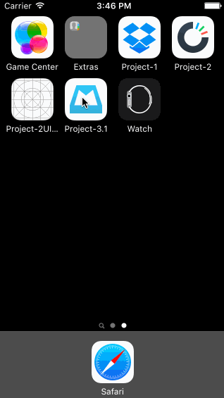

# Assignment 3: Mailbox

The purpose of this homework is to leverage animations and gestures to implement more sophisticated interactions. We're going to use the techniques from this week to implement the Mailbox interactions.

Time: I spent around 6-7 hours on the exercise

Walkthrough of all the project stories:

The GIF was created with [LiceCap](http://www.cockos.com/licecap/).